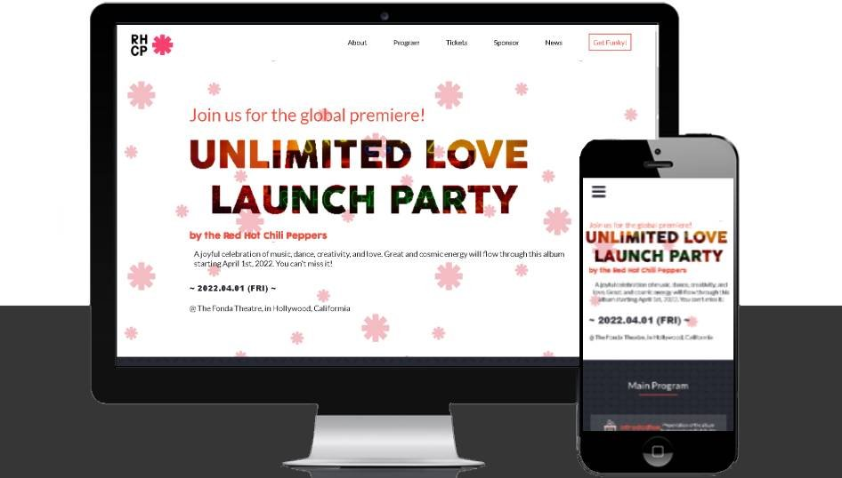

# Capstone Project #1

> This project is a showcase of the habilities learned during the portal weeks at micorverse.
> Its centered around a Launch Party for the new RHCP album.

## Project Deployment

- Watch the project live [here](https://alexpuente0.github.io/Capstone_festival/index.html).
- Watch a video about the project [here](https://www.loom.com/share/4a11b762435441919e8adde463f0150e).

## Built With

- HTML
- CSS
- Javascript

## Author

👤 **Alex Puente**

- GitHub: [@alexpuente0](https://github.com/alexpuente0)
- Twitter: [@zero_rock](https://twitter.com/zero_rock)
- LinkedIn: [Alejandro Puente](https://www.linkedin.com/in/alejandro-puente-farías-154a7629/)

## 🤝 Contributing

Contributions, issues, and feature requests are welcome!

Feel free to check the [issues page](https://github.com/alexpuente0/Capstone_festival/issues).

## Show your support

Give a ⭐️ if you like this project!

## Acknowledgments

> Special Thanks to:

- [Cindy Shin](https://www.behance.net/adagio07) for the original design
- Microverse for the Readme Template
- The Red Hot Chili Peppers for the inspiration and their music

## 📝 License

This project is covered by the [MIT](/LICENSE) license
